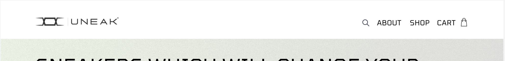
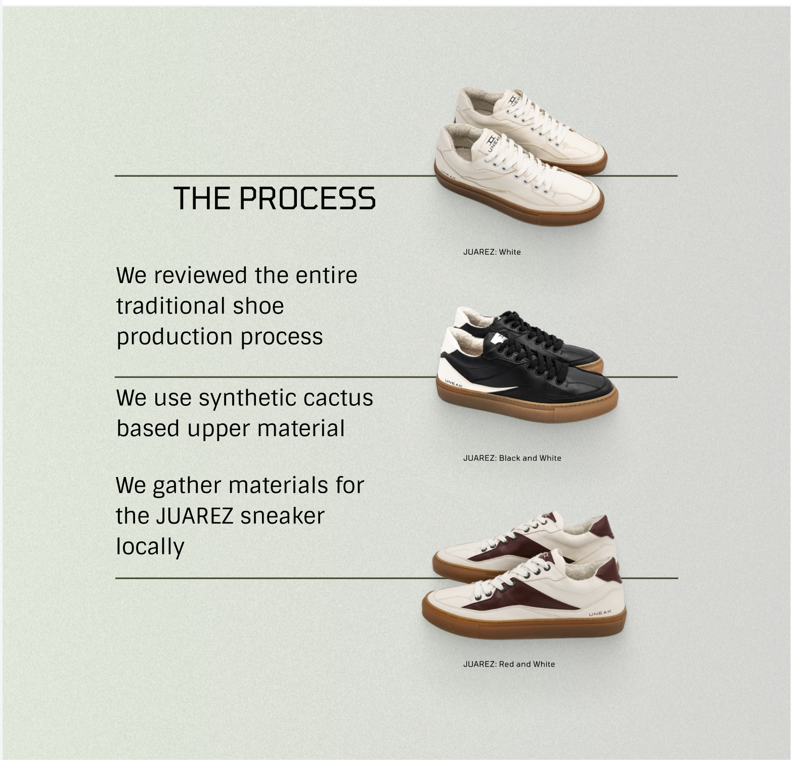

# HTML & CSS

## Домашне завдання №5

### Макет [тут](https://www.figma.com/file/C8BjRoCL25QL1stXbxjgOA/Front-end-Beginning-1.3---2.1?node-id=297-6&t=B5REntngt3q9dI8L-0):

Потрібно доробити розмітку сторінки.
Додати хедер та блок the process
Можна використовувати напрацювання попереднього завдання(не обовʼязково, можна тільки хедер і блок)

Вміло використовувати прийоми позиціонування та списки

!НЕ ЗЛОВЖИВАТИ АБСОЛЮТНИМ ПОЗИЦІОНУВАННЯМ!

- Врахувати структуру HTML.
- Додати всі необхідні метатеги.
- Розмітка має бути у файлі `index.html`
- Стилі мають буті у файли `style.css`
- Зображення потрібно складати у папочку images
- Результат повирнен максимально відповідати макету
– Шрифти можна брати з Google Fonts

# Як робити зав'дання

- Скопіюйте посилання для клонування репозиторію (випадає при натисканні на зелену кнопку code) та виконайте в терміналі або git bash команду `git clone https://github.com/prjctr-html-css/home-work-5.git`
- Перейдіть в папку із завданням `cd home-work-5`
- Перейдіть у гілку для домашнього завдання: `git checkout homework`
- Вирішить зав'дання.
- Почніть відстежувати нові файли, якщо додали їх: `git add .`.
- Створіть коміт: `git commit -a -m "homework"`
- Відправте коміт до GitHub: `git push --set-upstream origin homework`
- Зробіть пул-реквест відчинивши у браузері https://github.com/prjctr-html-css/[[username]]-home-work-5/pull/new/homework
