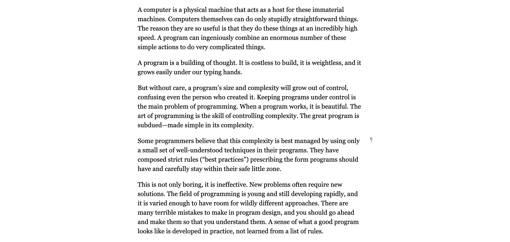

# HTML & CSS

## Домашне завдання №3

### Зробити сторінку на основі [статті](https://suspilne.media/451896-festival-bouquet-kyiv-stage-u-2023-roci-projde-u-tbilisi/):

Потрібно зробити тільки текст і зображення статті, соціальні мережі робити не потрібно
Фокус на зображення, посилання та стилізацію тексту(не брати частину тексту, де є список, для цього є окремий тег в html, який ми не проходили)

- Ви можете знайти [текст у репозиторії](./content.txt)
- Врахувати структуру HTML.
- Додати всі необхідні метатеги.
- Розмітка має бути у файлі `index.html`
- Стилі мають буті у файли `style.css`
- Зображення потрібно складати у папочку images (їх можна зберегти зі сторінки статті, права кнопка -> зберегти зображення як...)
- Результат повирнен мати два зображення з підписами
- Набільша увага на стилізацію тексту та посилань, щоб вона співпадала з оригіналом

# Як робити зав'дання

- Скопіюйте посилання для клонування репозиторію (випадає при натисканні на зелену кнопку code) та виконайте в терміналі або git bash команду `git clone https://github.com/prjctr-html-css/home-work-3.git`
- Перейдіть в папку із завданням `cd home-work-3`
- Перейдіть у гілку для домашнього завдання: `git checkout homework`
- Вирішить зав'дання.
- Почніть відстежувати нові файли, якщо додали їх: `git add .`.
- Створіть коміт: `git commit -a -m "homework"`
- Відправте коміт до GitHub: `git push --set-upstream origin homework`
- Зробіть пул-реквест відчинивши у браузері https://github.com/prjctr-html-css/[[username]]-home-work-3/pull/new/homework
